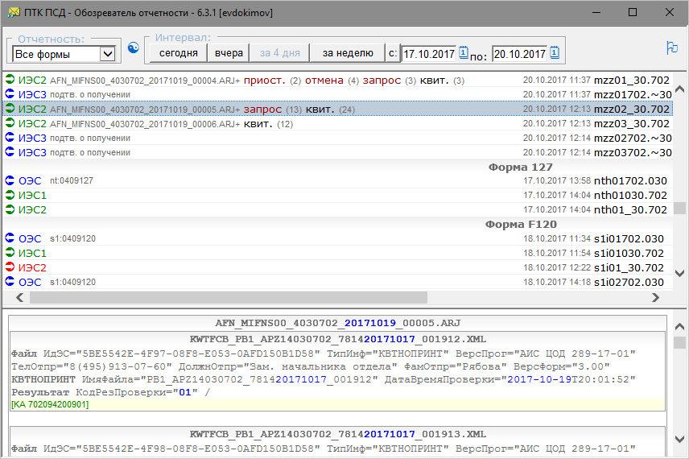

#  [ПТК ПСД - Обозреватель отчетности](http://diev.github.io/PTK-PSD-Browser-hta)

[](https://ci.appveyor.com/project/diev/ptk-psd-browser-hta)
[](https://github.com/diev/PTK-PSD-Browser-hta/releases/latest)

Наглядный просмотр и работа с архивом посылок [ПТК ПСД](http://ptkpsd.ru/) 
Банка России.



Данное HTA-приложение предназначено для просмотра архива посылок ПТК ПСД.
Хотя в штатном клиенте ПТК ПСД присутсвует такая возможность (кнопка с зеленой 
буквой "М" на панели инструментов по которой открывается поиск в архиве) но 
ущербность этой реализации подтолкнула на написание отдельной утилиты.

Смотрите также проект [SVK Transport](http://diev.github.io/SVK-Transport-hta) 
для доставки посылок в систему СВК Банка России.

## Основные возможности программы

* быстрый и наглядный просмотр всей корреспонденции - так, например, видно 
отчеты по какой форме содержатся в SA-посылках;
* фильтрация по типу посылки и интервалу дат;
* встроенный просмотр содержимого упакованных архивов (независимо от уровня 
вложенности!);
* анализ и подсветка ключевого содержимого посылки (дата, принят или нет 
и т.п.);
* контроль ключа аутентификации;
* возможность выгрузки в файл и печати любого сообщения;
* возможность моментального формирования подтверждений на решения 365-П;
* гибкие настройки.

## Замечания к использованию

* Распаковать дистрибутивный `zip` из 
[Releases](https://github.com/diev/PTK-PSD-Browser-hta/releases) в отдельную 
эталонную с этого момента подпапку `PTK_PSD_Browser\` в домашней директории 
официального клиента ПТК ПСД (обычно это `X:\PTK PSD\` где-нибудь на сети).
* Прописать это в `PTK_PSD_Browser.ini` - параметр `[Path]PTKPSD=X:\PTK PSD\`.
* Там же скорректировать строку подключения к SQL-серверу с базой данных 
ПТК ПСД `ELODB` и указать файл для общего сетевого кеша (рекомендуется).
* В подпапку `bin\` добавить (если нет в дистрибутиве) два бинарных файла 
`7z.exe` и `7z.dll` из комплекта с сайта [7-zip.org](http://7-zip.org/).
* После завершения настройки далее два варианта запуска: 
  * или напрямую из этой сетевой папки (тогда надо добавить имя сервера в 
список *Доверенные узлы* IE - без протоколов и слешей - одно только слово 
с именем сервера Windows; еще способ - добавить диапазон IP доверенных 
серверов)  
*Из сообращений безопасности Microsoft Internet Explorer, в среде 
которого фактически работает эта HTA программа, доступ к файлам по сети 
приравнивается к доступу за пределы домена и блокируется. Программа 
пытается своими силами добавить сервер своего запуска в доверенные, 
но не во всех управляемых корпоративных окружениях это ей удается.*  
*Так, если эта настройка включена в GPO, то имя сервера и номер зоны 2 
следует добавлять в:*
```
    Конфигурация пользователя
      Политики
        Административные шаблоны
          Компоненты Windows
            Internet Explorer
              Панель управления браузером
                Вкладка "Безопасность"
                  Список назначений зоны для веб-сайтов
```
  * или скопировать эту эталонную папку на каждую рабочую станцию - можно 
в любое место, лишь бы диск был локальным - к тому же, локальная копия hta 
работает значительно быстрее!
* На выполнение программа вызывается запуском `PTK_PSD_Browser.hta`.
* После запуска нажать кнопку с флажком, чтобы создать ярлык на Рабочем столе.
* По умолчанию программа берет настройки клиента ПТК ПСД из его файла 
`%WINDIR%\elo.ini` и своего файла `PTK_PSD_Browser.ini` в директории запуска, 
добавляя и перекрывая стандартные настройки клиента.
* При желании, в командной строке (в ярлыке) можно указать другие 
местоположения этих файлов (первый и второй параметр, соответственно).
Допускается использовать переменные среды (например, `%USERPROFILE%.ini`), 
в случае наличия пробелов необходимо заключить параметр в кавычки.
* Программа протестирована на наличие русских букв в путях, но это всегда 
может где-то вызывать ошибки.
* Для ускорения отображения каждый раз содержимого огромного числа файлов в 
многопользовательской сетевой среде рекомендуется использовать общий кеш.
* Однако если на сети одновременно используются разные версии программы, 
кеш может содержать отображения, сделанные более старыми версиями. 
В таких случаях надо очистить кеш (нажать кнопку обновления при нажатой 
клавише *Shift* или удалить общесетевой файл вручную). Иногда достаточно 
просто на файле выбрать в меню *Перечитать*, чтобы обновить информацию 
лишь об этом файле.
* Программа обладает свойством автообновления на клиентских местах (если 
у нее есть права на запись в папку своей установки, конечно), когда 
при запуске она обнаруживает в эталонной папке на сети более новую версию.
* Для снятия зависшей задачи в Диспетчере задач - найдите там `mshta.exe` 
(В Windows 10 - *Microsoft(R) HTML приложение (32 бита)*).

## История версий

Проект импортирован на GitHub с версии 6.0.6 с его страницы на 
[Bitbucket](https://bitbucket.org/html-applications/ptkpsd-browser).

Нумерация версий ведется по принципам 
[семантического версионирования](http://semver.org/lang/ru/) со следующими 
особенностями (для примера - пусть будет версия *6.3.1*):
* Старшая цифра (*6*) меняется, когда сильно 
меняется внешний вид (требуется новое обучение пользователей) или внутренний 
функционал программы (требуется обратить внимание администраторов и сделать 
вдумчивые перенастройки);
* Средняя цифра (*3*) - когда что-то добавляется во внешний вид 
(требуется обратить внимание пользователей - добавлена какая-то их хотелка) 
или добавлен параметр в файл настройки, поведение которого по умолчанию 
ничего для администраторов не меняет;
* Младшая цифра (*1*) - когда в программе сделаны какие-то незначительные 
изменения в коде или исправлены ошибки.


О более старой истории первоначального автора **mozers** есть в прилагаемом 
[файле](docs/changelog.md).

## Лицензионное соглашение

Licensed under the [Apache License, Version 2.0](LICENSE).  
(Вы можете использовать его совершенно свободно без всяких ограничений.)

Данные для обратной связи находятся в коде заголовка HTA приложения.  
(Всякие хотелки с удовольствием принимаются и претворяются.)
