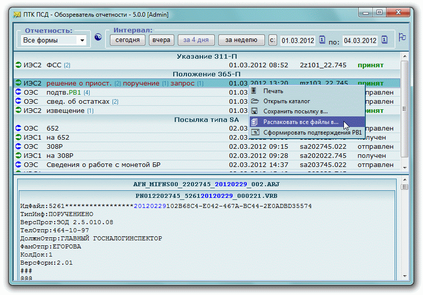

#  ПТК ПСД - Обозреватель отчетности

Наглядный просмотр и работа с архивом посылок ПТК ПСД Банка России.

Данное HTA-приложение предназначено для просмотра архива посылок ПТК ПСД.
Хотя в штатном клиенте ПТК ПСД присутсвует такая возможность (кнопка с зеленой 
буквой "М" на панели инструментов по которой открывается поиск в архиве) но 
ущербность этой реализации подтолкнула на написание отдельной утилиты.

Подробнее смотрите на [сайте](http://diev.github.io/PTK-PSD-Browser-hta).  
Смотрите также проект [SVK Transport](http://diev.github.io/SVK-Transport-hta) 
для доставки посылок в систему СВК Банка России.

## Основные возможности программы

* быстрый и наглядный просмотр всей корреспонденции - так, например, видно 
отчеты по какой форме содержатся в SA-посылках;
* фильтрация по типу посылки и интервалу дат;
* встроенный просмотр содержимого упакованных архивов (независимо от уровня 
вложенности!);
* анализ и подсветка ключевого содержимого посылки (дата, принят или нет 
и т.п.);
* контроль ключа аутентификации;
* возможность выгрузки в файл и печати любого сообщения;
* возможность моментального формирования подтверждений на решения 365-П;
* гибкие настройки.

## Замечания к использованию

* Распаковать дистрибутивный `zip` из 
[Releases](https://github.com/diev/PTK-PSD-Browser-hta/releases) в отдельную 
папку.
* Программа из соображений защиты IE работает только с локального диска!
* В подпапку `bin\` добавить (если нет в дистрибутиве) два бинарных файла 
`7z.exe` и `7z.dll` из комплекта с сайта [7-zip.org](http://7-zip.org/).
* До первого запуска программы внимательно изучить и отредактировать 
`PTK_PSD_Browser.ini`.
* После запуска `PTK_PSD_Browser.hta` нажать кнопку с флажком, чтобы создать 
ярлык на Рабочем столе :)

## История версий

Программа импортирована на GitHub с версии 6.0.6 с ее страницы на 
[Bitbucket](https://bitbucket.org/html-applications/ptkpsd-browser).  
О более старой истории первоначального автора **mozers** есть в прилагаемом 
[файле](docs/changelog.md).

## Лицензионное соглашение

Приложение распространяется по лицензии [Apache 2.0](LICENSE).  
(Вы можете использовать его совершенно свободно без всяких ограничений.)

Данные для обратной связи находятся в коде заголовка HTA приложения.
