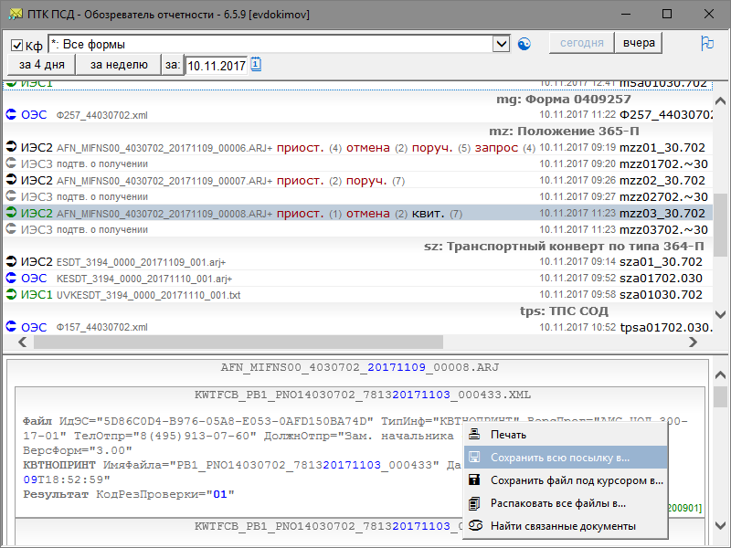

#  ПТК ПСД - Обозреватель отчетности

[](https://ci.appveyor.com/project/diev/ptk-psd-browser-hta)
[](https://github.com/diev/PTK-PSD-Browser-hta/releases/latest)

Наглядный просмотр и работа с архивом посылок [ПТК ПСД](http://ptkpsd.ru/) 
Банка России.



* [Основные возможности программы](#основные-возможности-программы)
* [Замечания к использованию](#замечания-к-использованию)
* [История версий, Changelog](#история-версий-changelog)
* [Идеи и пожелания, ошибки](#идеи-и-пожелания-ошибки)
* [Лицензионное соглашение](#лицензионное-соглашение)
* [Скачать](#download)

-----

Данное HTA-приложение предназначено для просмотра архива посылок ПТК ПСД.
Хотя в штатном клиенте ПТК ПСД присутсвует такая возможность (кнопка с зеленой 
буквой "М" на панели инструментов по которой открывается поиск в архиве), но 
ущербность этой реализации подтолкнула на написание отдельной утилиты.

Смотрите также проект [SVK Transport](/SVK-Transport-hta) 
для доставки посылок в систему СВК Банка России по протоколу HTTP.

## Основные возможности программы

* быстрый и наглядный просмотр всей корреспонденции - так, например, видно, 
отчеты по какой форме содержатся в SA-посылках;
* фильтрация по типу посылки и интервалу дат;
* встроенный просмотр содержимого упакованных архивов (независимо от уровня 
вложенности!);
* анализ и подсветка ключевого содержимого посылки (дата, принят или нет 
и т.п.);
* контроль ключа аутентификации (КА);
* возможность выгрузки в файл и печати любого сообщения;
* возможность моментального формирования подтверждений на решения 365-П
(удалено, начиная с версии 6.6.1, в связи с потерей актуальности);
* гибкие настройки.

## Замечания к использованию

* Распаковать из дистрибутивного `zip`, взятого из 
[Releases](https://github.com/diev/PTK-PSD-Browser-hta/releases), 
папку `PTK_PSD_Browser\` в домашнюю директорию официального клиента ПТК ПСД 
(обычно это `X:\PTK PSD\` где-нибудь на сети).
* Прописать это в `PTK_PSD_Browser.ini` - параметр `[Path]PTKPSD=X:\PTK PSD\`.
* Там же скорректировать нужные настройки для вашего варианта подключения 
к базе данных ПТК ПСД и указать файл для общего сетевого кеша (рекомендуется).
* Создать подпапку `bin\` (по умолчанию) и добавить в нее два бинарных 
файла `7z.exe` и `7z.dll` из свободно распространяемого пакета ПО 
[7-Zip](http://www.7-zip.org/download.html) 
(самая компактная версия - [7z920.exe](http://www.7-zip.org/a/7z920.exe), 
но 16.04 и выше также автоопределяются и поддерживаются, x86 и x64) или же 
указать местоположение имеющегося распаковщика в `PTK_PSD_Browser.ini`.
* После завершения глобальной настройки далее два варианта запуска: 
  * или напрямую из этой сетевой папки (тогда надо добавить имя сервера в 
список *Доверенные узлы* IE - без протоколов и слешей - одно только слово 
с именем сервера Windows; еще способ - добавить диапазон IP доверенных 
серверов)  
*Из сообращений безопасности Microsoft Internet Explorer, в среде 
которого фактически работает эта HTA программа, доступ к файлам по сети 
приравнивается к доступу за пределы домена и блокируется. Программа 
пытается своими силами добавить сервер своего запуска в доверенные, 
но не во всех управляемых корпоративных окружениях это ей удается.*  
*Так, если эта настройка включена в GPO, то имя сервера и номер зоны 2 
следует добавлять в:*
```
    Конфигурация пользователя
      Политики
        Административные шаблоны
          Компоненты Windows
            Internet Explorer
              Панель управления браузером
                Вкладка "Безопасность"
                  Список назначений зоны для веб-сайтов
```
  * или попробовать применить как Администратор файлы реестра из 
папки `admin` (подробнее в статье [Internet Explorer security zones 
registry entries for advanced 
users](https://support.microsoft.com/en-us/help/182569/internet-explorer-security-zones-registry-entries-for-advanced-users) 
на сайте Microsoft).
  * или проще скопировать эту эталонную папку на каждую рабочую станцию - 
можно в любое место, лишь бы диск был локальным - к тому же, локальная копия 
hta (и с общим сетевым кешем) работает максимально быстро!
* На выполнение программа вызывается запуском `PTK_PSD_Browser.hta`.
* После запуска нажать кнопку с флажком, чтобы создать ярлык на Рабочем столе.
* По умолчанию программа берет настройки клиента ПТК ПСД из его 
файла `%WINDIR%\elo.ini` и своего файла `PTK_PSD_Browser.ini` в директории 
запуска, добавляя и перекрывая стандартные настройки клиента.
* При желании, в командной строке (в ярлыке) можно указать другие 
местоположения этих файлов (первый и второй параметр, соответственно).
Допускается использовать переменные среды (например, `%USERPROFILE%\elo.ini`
или `X:\PTK PSD\elo\%USERNAME%.ini` - как и в ярлыке Клиента ПТК ПСД у многих), 
в случае наличия пробелов необходимо заключить параметр в кавычки.
* Программа протестирована на наличие русских букв в путях, но это всегда 
может где-то вызывать ошибки.
* Для ускорения отображения каждый раз содержимого огромного числа файлов в 
многопользовательской сетевой среде рекомендуется использовать общий кеш.
* Для исключения конфликтов разных версий, в указанное имя файла кеша 
программа добавляет свой номер версии. 
* При любых повреждениях отображаемой информации следует перезагрузить 
кеш (нажать кнопку обновления при нажатой клавише *Shift*). Для обновления 
только одного файла, достаточно с помощью контекстного меню *Перечитать*.
* Программа обладает свойством автообновления на клиентских местах (если 
у нее есть права на запись в папку своей установки, конечно), когда 
при запуске она обнаруживает в эталонной папке на сети более новую версию.
* Если программа была неудачно закрыта во время работы и нового запуска 
не происходит, в Диспетчере задач найдите `mshta.exe` и снимите ее 
(В Windows 10 - *Microsoft(R) HTML приложение (32 бита)*).

## История версий, Changelog

Проект импортирован на GitHub с версии 6.0.6 с его страницы на 
[Bitbucket](https://bitbucket.org/html-applications/ptkpsd-browser).

Нумерация версий старается следовать принципам 
[семантического версионирования](http://semver.org/lang/ru/) со следующими 
особенностями (для примера - пусть будет версия *6.3.1*):
* Старшая цифра (*6*) меняется, когда сильно 
меняется внешний вид (требуется новое обучение пользователей) или внутренний 
функционал программы (требуется обратить внимание администраторов и сделать 
вдумчивые перенастройки);
* Средняя цифра (*3*) - когда что-то добавляется во внешний вид 
(требуется обратить внимание пользователей - добавлена какая-то их хотелка) 
или добавлен параметр в файл настройки, поведение которого по умолчанию 
ничего для администраторов не меняет;
* Младшая цифра (*1*) - когда в программе сделаны какие-то незначительные 
изменения в коде или исправлены ошибки.

Одно примечание (в силу малости проекта): сразу после смены средней цифры 
младшая может взять часть ее функций, пока идет устаканивание и отладка 
нововведений.

Полная история версий в файле [CHANGELOG](https://github.com/diev/PTK-PSD-Browser-hta/blob/master/CHANGELOG.md).

## Идеи и пожелания, ошибки

Данные для обратной связи находятся в коде заголовка HTA приложения.  
(Всякие хотелки с удовольствием принимаются и претворяются.)

Есть некоторые [Идеи](https://github.com/diev/PTK-PSD-Browser-hta/projects/1) 
развития проекта.
Свои пожелания и сообщения об ошибках лучше размещать 
в [Issues](https://github.com/diev/PTK-PSD-Browser-hta/issues).

## Лицензионное соглашение

Licensed under the [Apache License, 
Version 2.0](http://www.apache.org/licenses/LICENSE-2.0 "LICENSE").  
Вы можете использовать его совершенно свободно без всяких ограничений.
