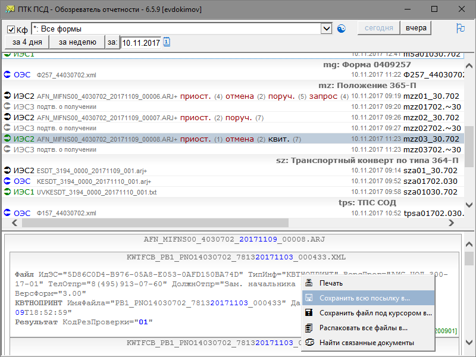

#  ПТК ПСД - Обозреватель отчетности

Наглядный просмотр и работа с архивом посылок [ПТК ПСД](http://ptkpsd.ru/) 
Банка России.

* [История версий, Changelog](#история-версий-changelog)
* [Идеи и пожелания, ошибки](#идеи-и-пожелания-ошибки)
* [Лицензионное соглашение](#лицензионное-соглашение)
* [Скачать](#download)

-----

Данное HTA-приложение предназначено для просмотра архива посылок ПТК ПСД.
Хотя в штатном Клиенте ПТК ПСД присутствует такая возможность (кнопка с зеленой 
буквой "М" на панели инструментов, по которой открывается поиск в архиве), но 
ущербность этой реализации подтолкнула на написание отдельной программы.

Подробнее о программе смотрите в [Wiki]({{ site.github.wiki_url }}).

Смотрите также проект [SVK Transport](/SVK-Transport-hta) 
для доставки посылок в систему СВК Банка России по протоколу HTTP.

## История версий, Changelog

Проект импортирован на GitHub с версии 6.0.4 с его страницы на 
[Bitbucket](https://bitbucket.org/html-applications/ptkpsd-browser).

Полная история версий в файле 
[CHANGELOG]({{ site.github.repository_url }}/blob/master/CHANGELOG.md).

## Идеи и пожелания, ошибки

Данные для обратной связи находятся в коде заголовка HTA приложения.  
(Всякие хотелки принимаются и по возможности претворяются.)

Есть некоторые [Идеи]({{ site.github.repository_url }}/projects/1) 
развития проекта.
Свои пожелания и сообщения об ошибках лучше размещать 
в [Issues]({{ site.github.issues_url }}).

## Лицензионное соглашение

Licensed under the [Apache License, 
Version 2.0](http://www.apache.org/licenses/LICENSE-2.0 "LICENSE").  
Вы можете использовать все совершенно свободно без всяких ограничений.
